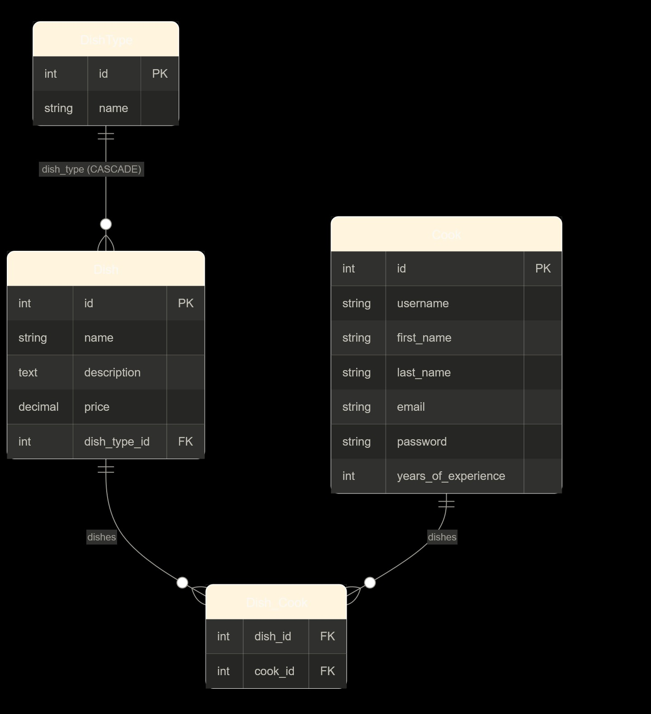
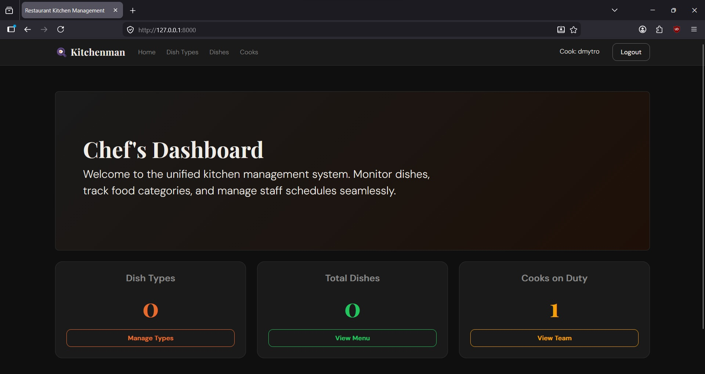
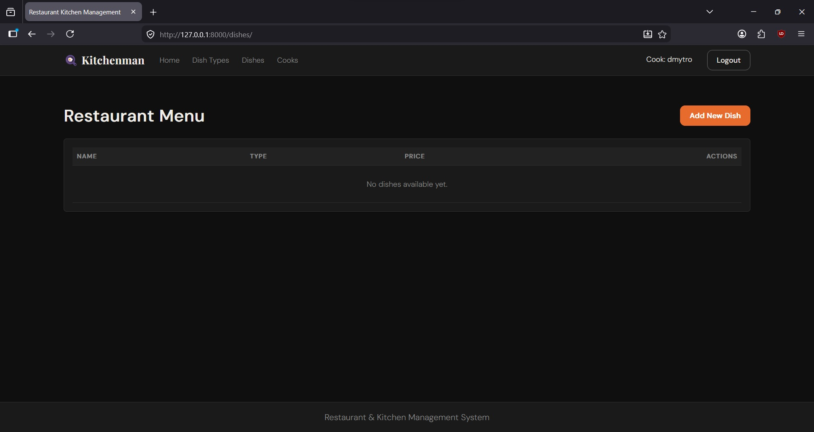
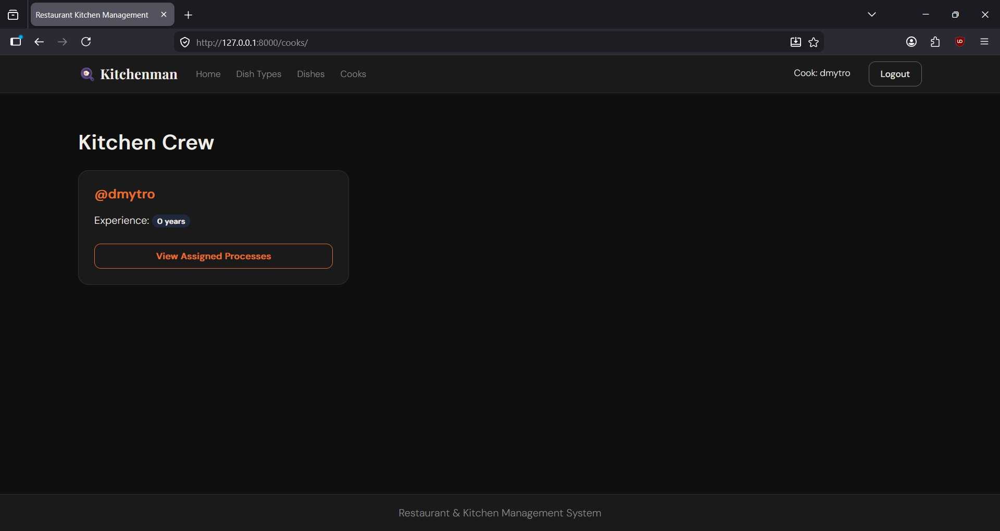

# Kitchenman: Restaurant & Kitchen Management System

Online: https://kitchenman.onrender.com

A robust, Django-based web application designed to streamline kitchen operations, 
manage restaurant menus, and coordinate cooking staff. 
This project serves as a comprehensive portfolio piece demonstrating 
complex database relationships, secure user authentication, 
and strict adherence to Class-Based View (CBV) architecture.

## Features

* **Authentication System**: Custom `Cook` user model extending Django's `AbstractUser`, isolated within a dedicated `users` app.
* **Menu & Category Management**: Full CRUD operations for `Dish` and `DishType` entities.
* **Complex Workflows (M2M)**: Dynamic assignment of multiple cooks to specific dishes using Many-to-Many relationships.
* **Class-Based Views (CBV) Only**: Strict usage of Django's generic views (ListView, DetailView, CreateView, UpdateView, DeleteView) for all business logic.
* **Responsive UI**: Clean, mobile-friendly interface built with Bootstrap.

## Database schema

The database architecture is designed with clear relational boundaries:
* `Cook` (Custom User): Represents the kitchen staff.
* `DishType`: Categorizes dishes (e.g., Starters, Mains, Desserts).
* `Dish`: The core entity, linking to `DishType` (One-to-Many) and assigned to `Cook`s (Many-to-Many).

> 

## Screenshots

> 
> 
> 

## Installation & setup

Follow these steps to run the project locally.

**1. Clone the repository**
```bash
git clone git@github.com:dimitr-dev/py-kitchen-management.git
cd py-kitchen-management
```

**2. Set up the virtual environment**
```bash
python -m venv venv
source venv/bin/activate  # On Windows use: venv\Scripts\activate
```
**3. Install dependencies**

```bash
pip install -r requirements.txt
```

**4. Apply database migrations**
```bash
python manage.py migrate
```
**5. Register administrator account**
```bash
python manage.py createsuperuser
```

**6. Run the development server**
```bash
python manage.py runserver
```

Open your browser and navigate to http://127.0.0.1:8000/
